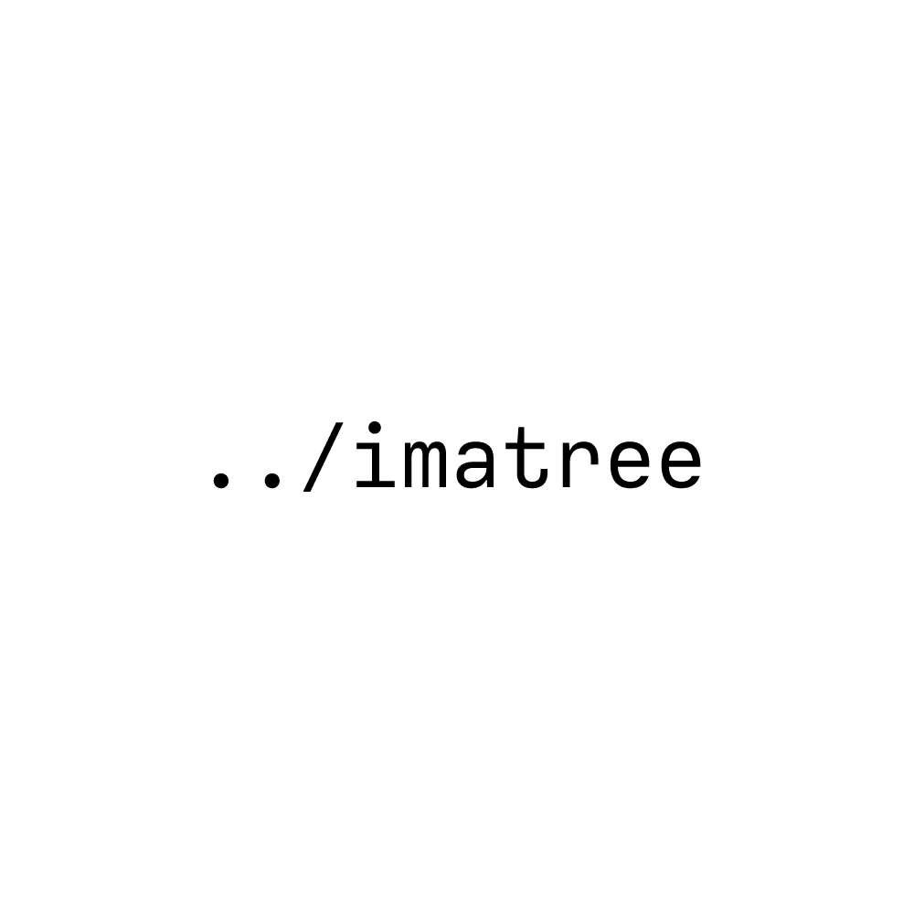

# Imatree

## Usage

```rust
cargo run --bin create -- --name "name"
```

## Help

	 -n, --name <NAME>            The name of the image to create
	 -p, --path <PATH>            Path to save the image [default: Current directory]
	 -c, --color <COLOR>          The color of the text [default: Black]
	 -f, --font-size <FONT_SIZE>  The font size of the text [default: 0] -- 0 is auto
	 -w, --width <WIDTH>          The width of the image [default: 1000]
	 -t, --height <HEIGHT>        The height of the image [default: 1000]
	 -h, --help                   Print help
	 -V, --version                Print version

## Examples


